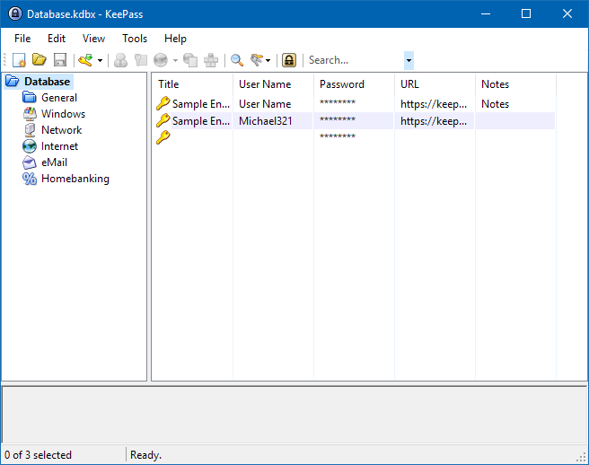
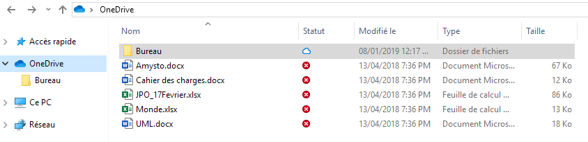
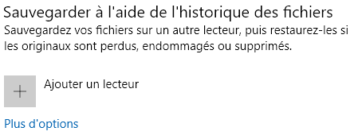
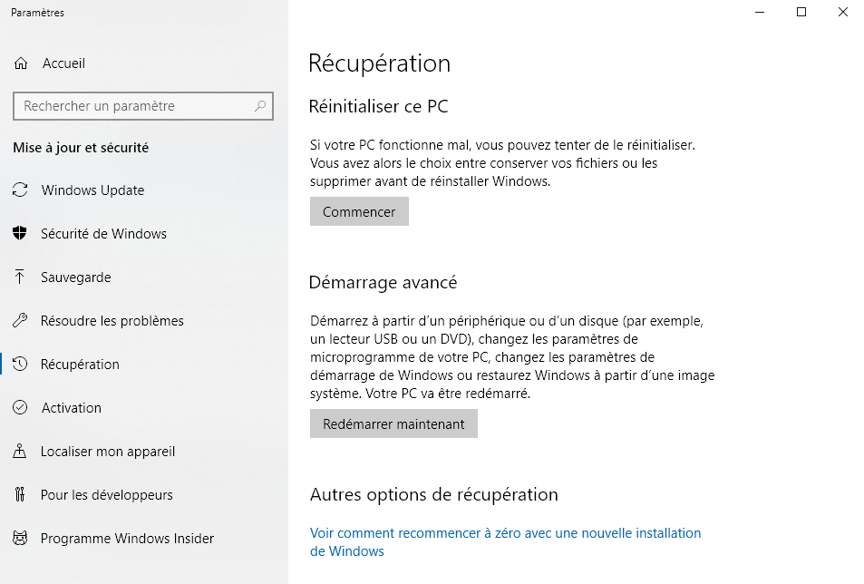

# int-syst
Sécurité sur son laptop et sauvegarde de données

## Sécurité des données

### Sécurité des dossiers et des mots de passe
Aujourd'hui, la sécurité est au coeur de tout, du développement au réseau en passant par les sites web et les applications mobiles. Pour créer un compte, le mot de passe est souvent très varié allant de 0 caractères à parfois 24 caractères comprenant chiffres, lettres (minuscules et majuscules) sans oublier les caractères spéciaux.
On peut aussi parler des mots de passes en entreprise.

Entre les changements de mots de passes tous les mois, trois mois ou meme jamais, on fini par oublier nos mots de passes, il faut donc stockés ces mots de passes quelques parts, mais où ?
Sur papiers ? en entreprise c'est tout sauf sécurisé et puis il faut avoir le papier en permanence avec soi.
Sur l'ordinateur alors ? oui dans un fichier mais il faut que ce fichier soit sécurisé.

Alors comment faire ? la solution retenue : **keepass**

### Keepass 16 ans de savoir faire
Keepass est un gestionnaire de mots de passes qui permet de stocker tous ces mots de passes dans un fichier unique. Ce fichier est bien sur chiffré avec un mot de passe complexe.

**___Windows    (dossier windows)**     
**___Network    (réseau d'entreprise, wifi)**    
**___Internet   (mot de passe sur les listes web)**         
**___eMail      (mot de passe de la boite mail)**     

### Ce qu'apporte Keepass
Généralement, keepass chiffre au moins en 256 bits avec des protocoles comme ChaCha20, SHA-256. Ces chiffrements permettent de se protéger des attaques comme par exemple les attaques de dictionnaires.

### Mise en pratique
Mon mot de passe constitue un code 23 caractères composé de chiffre, lettre (miniscules et majuscules) ainsi que de signes spéciaux. Avec un telle durcissement et ue sécurité en SHA-512 (512 bits) les données sont bien protégées dans un fichier sécurisé.

## Sauvegarde des données 
Pour ce qui est de la sauvegarde des données, windows propose deux façons. Un oneDrive et une sauvegarde sur un disque dur (externe si possible. 

Avec le OneDrive on peut stocker nos dossier et données non personnel. Les sauvegardes sont rapides et automatiques (cloud).

Avec la sauvegarde sur un disque dur externe c'est pas la même chose.

Pour la récupération de données, 3 clics et c'est fait.

